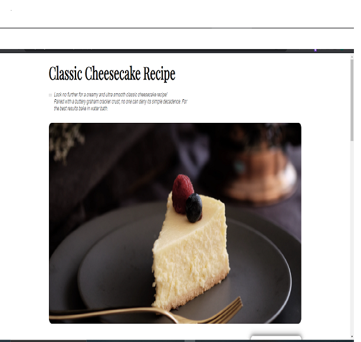

<!-- Please update value in the {}  -->

<h1 align="center">Recipe Blog</h1>

<div align="center">
   Solution for a challenge from  <a href="http://devchallenges.io" target="_blank">Devchallenges.io</a>.
</div>

<div align="center">
  <h3>
    <a href="https://kinjames.github.io/dev-challenge-recipe-page/">
      Demo
    </a>
    <span> | </span>
    <a href="https://github.com/kinjames/dev-challenge-recipe-page">
      Solution
    </a>
    <span> | </span>
    <a href="https://devchallenges.io/challenges/OEKdUZ6xs0h99C38XVht">
      Challenge
    </a>
  </h3>
</div>

<!-- TABLE OF CONTENTS -->

## Table of Contents

- [Overview](#overview)
  - [Built With](#built-with)
- [Features](#features)
- [How to use](#how-to-use)
- [Contact](#contact)
<!-- - [Acknowledgements](#acknowledgements) -->

<!-- OVERVIEW -->

## Overview



This is a recipe blog page. It can be viewed here https://kinjames.github.io/dev-challenge-recipe-page/, this project taught me alot. And one importaant lesson i learnt is to tackle all projects with all seriousness. Never undermine any project or feel like a project is too easy so you can just relax on it. The amzing thing about coding is that it gives you this sense of accomplishment when you complete a project and that is the same way it gets you frustrated when something is not working. 


### Built With

<!-- This section should list any major frameworks that you built your project using. Here are a few examples.-->

- [HTML](https://html.com/)
- [CSS](https://www.w3schools.com/css/)

## Features

<!-- List the features of your application or follow the template. Don't share the figma file here :) -->

This application/site was created as a submission to a [DevChallenges](https://devchallenges.io/challenges) challenge. The [challenge](https://devchallenges.io/challenges/TtUjDt19eIHxNQ4n5jps) was to build an application to complete the following user stories:

- [x] User story: This is a completed user stories
<!-- - [ ] User story: This is a incompleted user stories
- [ ] User story: This is a incompleted 2nd user stories -->

## How To Use

To clone and run this application, you'll need [Git](https://git-scm.com) and [Node.js](https://nodejs.org/en/download/) (which comes with [npm](http://npmjs.com)) installed on your computer. From your command line:

```bash
# Clone this repository
$ git clone https://github.com/kinjames/dev-challenge-recipe-page

# # Install dependencies
# $ npm install

# # Run the app
# $ npm start
```

<!-- ## Acknowledgements -->

<!-- This section should list any articles or add-ons/plugins that helps you to complete the project. This is optional but it will help you in the future. For exmpale -->

<!-- - [Steps to replicate a design with only HTML and CSS](https://devchallenges-blogs.web.app/how-to-replicate-design/)
- [Node.js](https://nodejs.org/)
- [Marked - a markdown parser](https://github.com/chjj/marked) -->

## Contact

<!-- - Website [your-website.com](https://{your-web-site-link}) -->
- GitHub [@kinjames](https://github.com/kinjames)
- Twitter [@TheBlackCoder7](https://twitter.com/TheBlackCoder7)
